# 🏦 MiniBank - Демо-конфигурация

> **Портфолио для собеседования на позицию 1С-разработчика**
> Проект демонстрирует навыки архитектуры метаданных, интеграций, автоматизации и построения сложных отчетов.

## 📋 О проекте
Полнофункциональная демонстрационная конфигурация, моделирующая ключевые процессы розничного банка:
- Управление клиентами и счетами
- Платежи и кредитование
- Интеграция с API ЦБ РФ
- Аудит действий пользователей
- Аналитическая отчетность

## 🚀 Ключевые фичи

### 1. 🔐 Аудит действий (Security by Design)
- Регистрация всех действий пользователя (создание, изменение, проведение, удаление)
- Фиксация IP-адреса и ID сеанса для каждого события
- Журнал аудита с удобным отчетом (группировка по дням, цветовая индикация)

### 2. 💳 Интеграция с банком
- Внешняя обработка для выгрузки платежей в формате **1CClientBankExchange**
- Пакетное создание платежей из Excel (с индикатором выполнения)
- Работает со стандартом, который понимают все российские банки

### 3. ⏰ Автоматизация процессов
- Регламентное задание для ежедневного обновления курсов валют с сайта ЦБ РФ
- Фоновая работа без участия пользователя
- Запись результатов в журнал регистрации

### 4. 📊 Профессиональные отчеты
- **Платежный календарь** (план + факт, группировка по статусам и датам, расчет остатков)
- **Анализ задолженности** (дебиторка/кредиторка, выделение просрочки)
- **Реестр платежей** (детализация по дням с итогами)

### 5. 🖨️ Печатные формы
- Готовая печатная форма "Платежное поручение"
- Автоматическая подстановка данных из документа-основания (счета/заявки)

### 6. 📦 Документы планирования
- **Счет на оплату** — фиксация ожидаемых поступлений
- **Заявка на расход ДС** — планирование будущих платежей
- Статусная модель: План → Исполнен (автоматически при проведении платежки)

## 🏗 Архитектура
Проект реализован на управляемых формах с использованием:
- Справочники (Клиенты, Банковские счета, Валюты, Типы счетов)
- Документы (Платежное поручение, Ввод остатков, Заявка на кредит, Счета, Заявки)
- Регистры накопления (Остатки на счетах) и сведений (Курсы валют, Журнал аудита)
- Внешние и внутренние обработки для расширения функционала

## 📸 Скриншоты работы

### Главное меню
[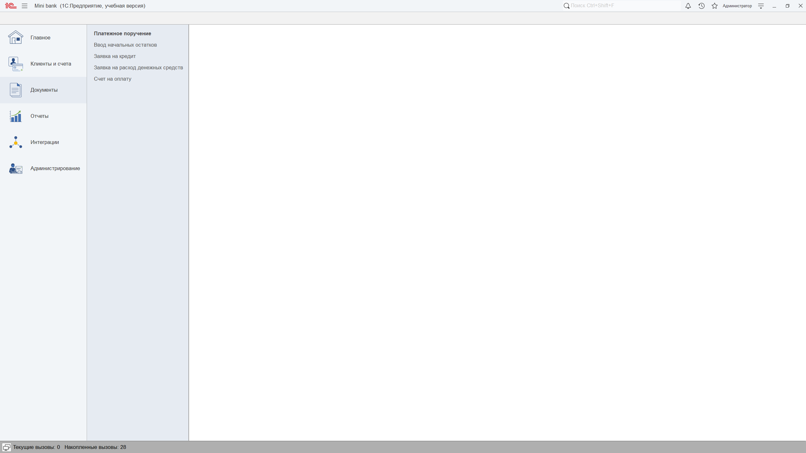](docs/screenshots/01_main_menu.png)

### Аудит действий
[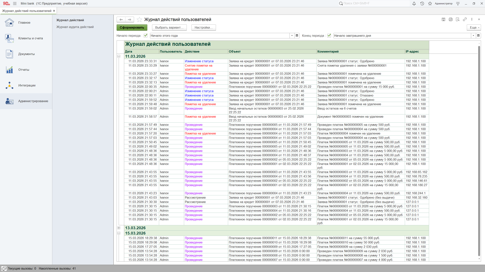](docs/screenshots/02_audit_log.png)

### Платежный календарь
[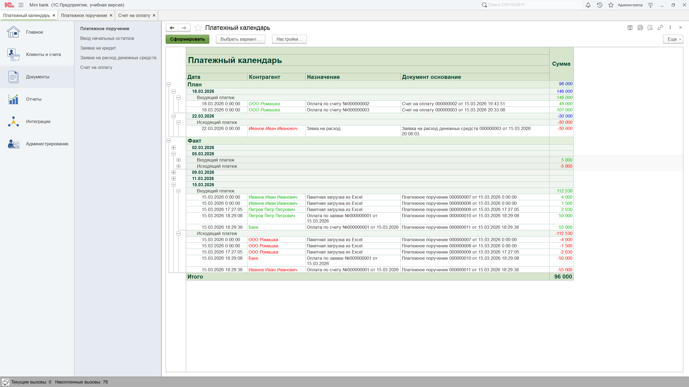](docs/screenshots/03_payment_calendar.png)

### Анализ задолженности
[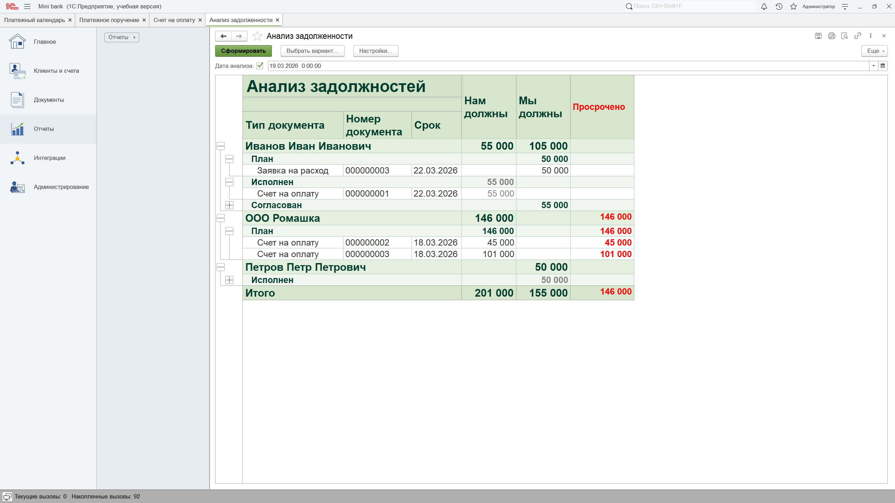](docs/screenshots/04_debt_analysis.png)

### Реестр платежей
[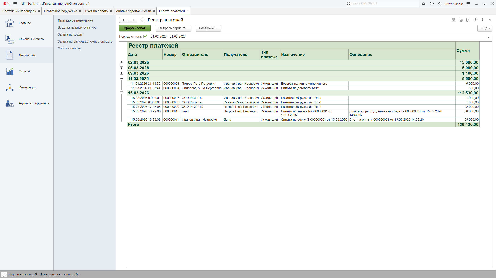](docs/screenshots/05_payment_register.png)

### Пакетная загрузка из Excel
[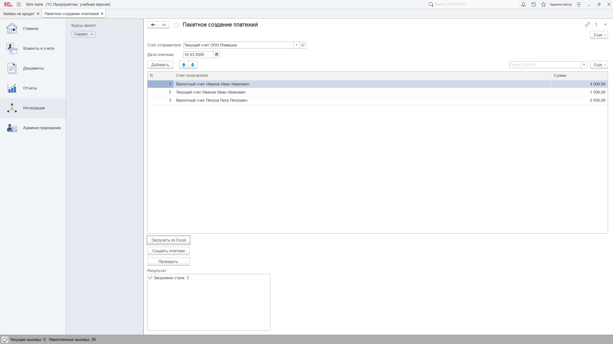](docs/screenshots/06_excel_upload.png)

### Выгрузка платежей в банк
[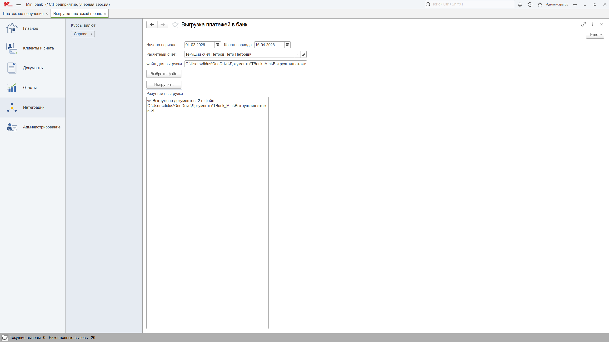](docs/screenshots/11_bank_export.png)

### Печатная форма
[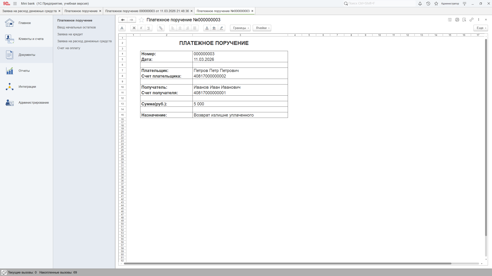](docs/screenshots/07_print_form.png)

### Документы планирования (Счет на оплату)
[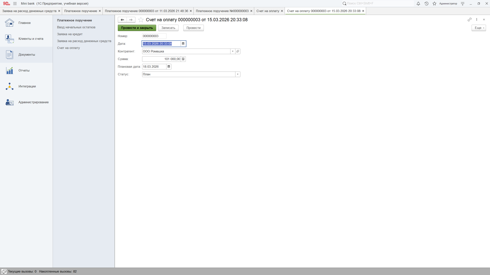](docs/screenshots/08_invoice_plan.png)

### Документы планирования (Заявки на расход денежных средств)
[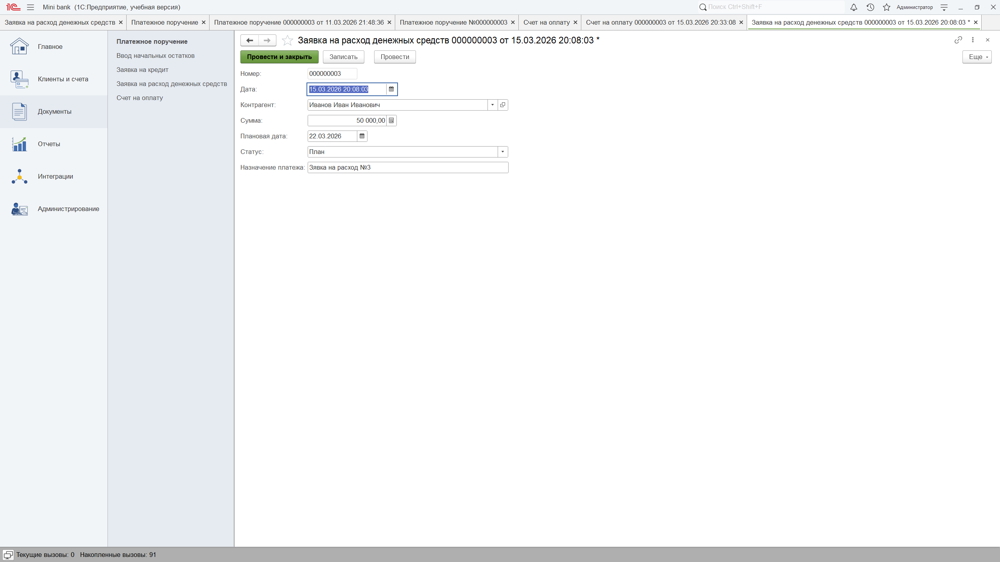](docs/screenshots/09_expense_plan.png)

### Регламентное задание
[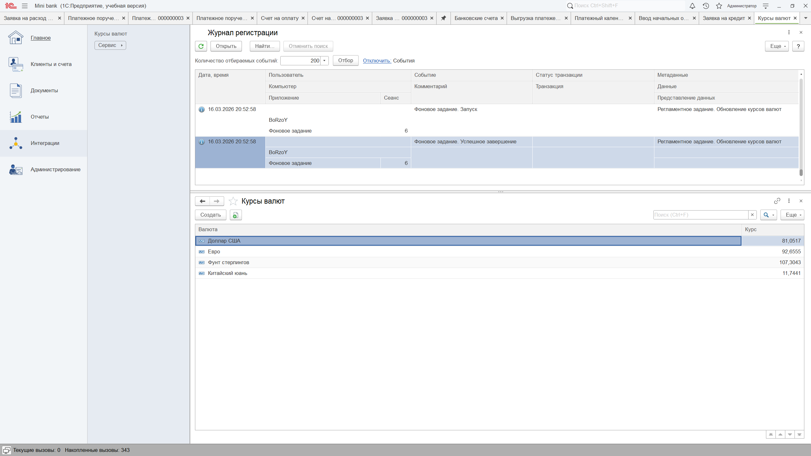](docs/screenshots/10_scheduled_job.png)


## 🎥 Видеодемонстрация

<video src="https://github.com/user-attachments/assets/a78b31a7-a028-4c97-a144-86e6a1f0c2c1" width="900" controls></video>

*Демонстрация работы конфигурации «Мини-Банк»*


## 🔧 Быстрый старт
### Требования
- Платформа **1С:Предприятие 8.3.22+**
- Доступ в интернет (для обновления курсов валют)

### Установка
Склонировать репозиторий:
   ```bash
   git clone https://github.com/твой-ник/TBank-MiniBank.git
   ```
В конфигураторе 1С создать пустую базу.
Загрузить конфигурацию из файлов (src/) через меню "Конфигурация" → "Загрузить конфигурацию из файлов".


📌 Планы по развитию (Roadmap)
- Реализовать разграничение прав доступа (RLS)
- Добавить бизнес-процесс согласования заявок на расход
- Создать мобильное приложение для просмотра остатков


> **Разработано для демонстрации навыков в 2026 г.**
